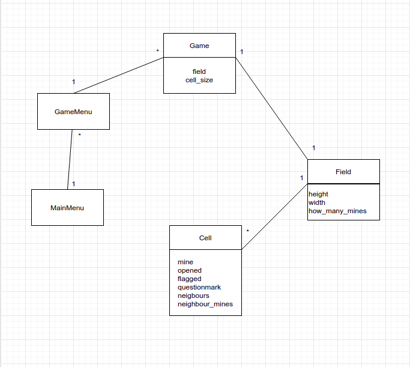

# Arkkitehtuurikuvaus:
## Luokkarakenne:
### Sovelluslogiikka
toistaiseksi miinaharava pelin sovelluslogiikasta vastaavat luokat [Game](https://github.com/vilkiida/ot-harjoitustyo/blob/master/src/game.py), [Field](https://github.com/vilkiida/ot-harjoitustyo/blob/master/src/field.py) ja [Cell](https://github.com/vilkiida/ot-harjoitustyo/blob/master/src/cell.py). Luokat [Minesweeper](https://github.com/vilkiida/ot-harjoitustyo/blob/master/src/minesweeper.py), [GameMenu](https://github.com/vilkiida/ot-harjoitustyo/blob/master/src/gamemenu.py), [HighscoresMenu](https://github.com/vilkiida/ot-harjoitustyo/blob/master/src/highscores_menu.py), [Instructions](https://github.com/vilkiida/ot-harjoitustyo/blob/master/src/instructions.py) muodostavat pelivalikon. Näistä luokkia [Minesweeper](https://github.com/vilkiida/ot-harjoitustyo/blob/master/src/minesweeper.py) ja [GameMenu](https://github.com/vilkiida/ot-harjoitustyo/blob/master/src/gamemenu.py) tarvitaan pelin käynnistämiseen.

#### Luokkakaavio:

### Päätoiminnallisuudet:
Kuvauksia muutamista sovelluksen pää toiminnallisuuksista:

#### Miinaharava pelin aloittaminen:
Seuraava sekvenssikaavio kuvastaa pelivalikon toimintaa ja sitä miten pelin käynnistyttyä käyttäjä saa aloitettua helppo-vaikeustasoisen miinaharava-pelin. UI seuravaassa kaaviossa tarkoittaa tässä tapauksessa pelin graafista käyttöliittyymää, joka syntyy pygamen avulla.

