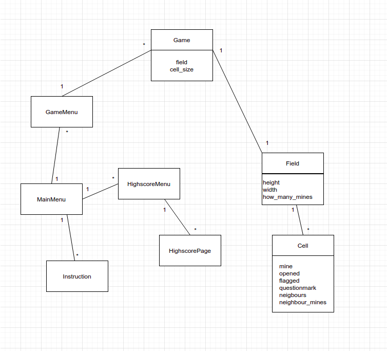
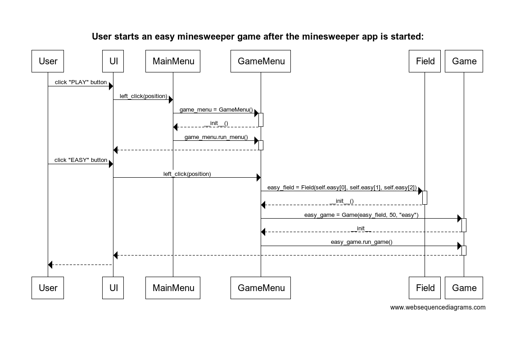
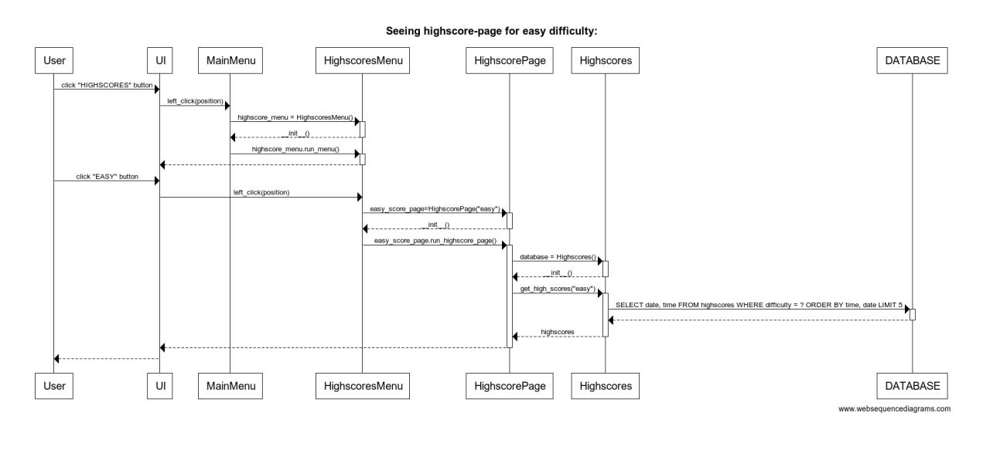

# Arkkitehtuurikuvaus:
## Rakenne:
- Pelin käynnistävä [minesweeper.py](https://github.com/vilkiida/ot-harjoitustyo/blob/master/src/minesweeper.py) tiedosto sijaitsee src hakemistossa. Myöskin kuvien lataukseen käytettävä moduuli [load_image.py](https://github.com/vilkiida/ot-harjoitustyo/blob/master/src/load_image.py) ja tietokannan alustamisen moduuli [initialize_database.py](https://github.com/vilkiida/ot-harjoitustyo/blob/master/src/initialize_database.py) sijaitsevat src hakemistossa.
- Loput koodista on eroteltu src hakemiston sisällä oleviin alahakemistoihin. Tälläisia alahakemistoja ovat [gamemodules](https://github.com/vilkiida/ot-harjoitustyo/tree/master/src/gamemodules), [menumodules](https://github.com/vilkiida/ot-harjoitustyo/tree/master/src/menumodules), [othermodules](https://github.com/vilkiida/ot-harjoitustyo/tree/master/src/othermodules) ja [databasemodules](https://github.com/vilkiida/ot-harjoitustyo/tree/master/src/databasemodules).
- Gamemodules hakemisto sisältää moduulit game, field ja cell, jotka vastaavat itse miinaharavapelin toiminnasta.
- Menumodules hakemustossa olevat mainmenu, gamemenu ja highscores_menu moduulit vastaavat sovelluksen valikoista.
- Databasemodules hakemistossa sijaitseva highscore_handling.py vastaa tietokannan käsittelyyn liittyvästä koodista ja highscores.db toimii pelin SQL-tietokantana.
- Othermodules hakemistossa oleva instructions.py vastaa pelin peliohjeesivusta ja highscores_page.py highscore sivuista.
- Src hakemistossa olevasta [assets](https://github.com/vilkiida/ot-harjoitustyo/tree/master/src/assets) hakemistosta löytyy kaikki sovelluksen kuvatiedostot. - - Src hakemistossa olevasta [tests](https://github.com/vilkiida/ot-harjoitustyo/tree/master/src/tests) hakemistosta löytyy sovelluksen testaukseen liittyvä koodi.

## Luokkarakenne:

### Sovelluslogiikka
- Itse miinaharava pelin sovelluslogiikasta vastaavat luokat [Game](https://github.com/vilkiida/ot-harjoitustyo/blob/master/src/gamemodules/game.py), [Field](https://github.com/vilkiida/ot-harjoitustyo/blob/master/src/gamemodules/field.py) ja [Cell](https://github.com/vilkiida/ot-harjoitustyo/blob/master/src/gamemodules/cell.py).
- Luokat [MainMenu](https://github.com/vilkiida/ot-harjoitustyo/blob/master/src/menumodules/mainmenu.py), [GameMenu](https://github.com/vilkiida/ot-harjoitustyo/blob/master/src/menumodules/gamemenu.py) ja [HighscoresMenu](https://github.com/vilkiida/ot-harjoitustyo/blob/master/src/menumodules/highscores_menu.py) vastaavat valikoista.
- [Instructions](https://github.com/vilkiida/ot-harjoitustyo/blob/master/src/othermodules/instructions.py) luokka vastaa ohjesivusta ja [Highscorepage](https://github.com/vilkiida/ot-harjoitustyo/blob/master/src/othermodules/highscores_page.py) highscore sivuista.

#### Luokkakaavio:

### Käyttöliittymä:
Käyttöliittymässä on useampi erilainen näkymä.
- Päävalikko
- Pelivalikko
- Highscoresvalikko
- Ohjesivu
- Miinaharava peli
- Highscores taulukko (kesken)

Jokaista näkymää varten on oma luokkansa.

Sekä valikoissa että itse pelissä käyttäjä tekee haluamansa toiminnot hiiren avulla.

### Tietojen pysyväistallennus:
Tietojen eli tässä tapauksessa highscore-tuloksien tallentamisesta vastaa databasemodules hakemistossa oleva luokka [highscore_handling.py](https://github.com/vilkiida/ot-harjoitustyo/blob/master/src/databasemodules/highscore_handling.py). Tiedot tallennetaan samassa hakemistossa olevaan [highscores.db](https://github.com/vilkiida/ot-harjoitustyo/blob/master/src/databasemodules/highscores.db) SQL-tietokantaan.

## Päätoiminnallisuudet:
Kuvauksia muutamista sovelluksen päätoiminnallisuuksista:

### Miinaharava pelin aloittaminen:
Seuraava sekvenssikaavio kuvastaa pelivalikon toimintaa ja sitä miten pelin käynnistyttyä käyttäjä saa aloitettua helppo-vaikeustasoisen miinaharava-pelin. UI seuravaassa kaaviossa tarkoittaa tässä tapauksessa pelin graafista käyttöliittyymää, joka syntyy pygamen avulla.

### Highscore-sivun katsominen:

Seuraava sekvenssikaavio kuvastaa pelivalikon, highscore-sivun ja tietokannan yhteistoimintaa ja sitä miten pelin käynnistyttyä käyttäjä saa katsottua helpontason highscorelistan. UI seuraavassa kaaviossa tarkoittaa tässä tapauksessa pelin graafista käyttöliittymää, joka syntyy pygamen avulla. DATABASE on tässä tapauksessa databasemodules hakemiston highscores.db SQL-tietokanta.

