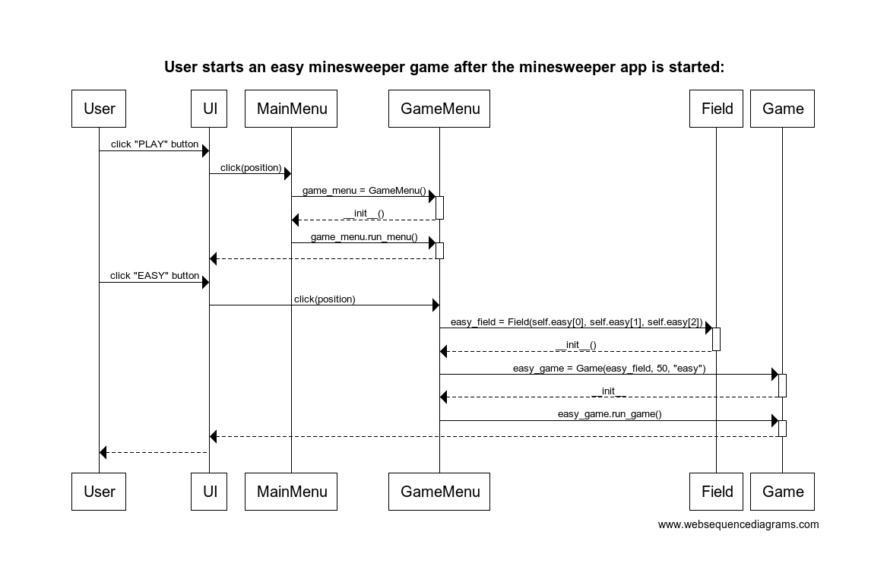

# Arkkitehtuurikuvaus:
## Rakenne:
Pelin käynnistävä päävalikko moduuli [minesweeper.py](https://github.com/vilkiida/ot-harjoitustyo/blob/master/src/minesweeper.py) tiedosto sijaitsee src hakemistossa. Myöskin kuvien lataukseen käytettävä moduuli [load_image.py](https://github.com/vilkiida/ot-harjoitustyo/blob/master/src/load_image.py) ja tietokannan alustamisen moduuli [initialize_database.py](https://github.com/vilkiida/ot-harjoitustyo/blob/master/src/initialize_database.py) sijaitsevat src hakemistossa. Loput koodista on eroteltu src hakemiston sisällä oleviin alahakemistoihin. Tälläisia alahakemistoja ovat [gamemodules](https://github.com/vilkiida/ot-harjoitustyo/tree/master/src/gamemodules), [menumodules](https://github.com/vilkiida/ot-harjoitustyo/tree/master/src/menumodules), [othermodules](https://github.com/vilkiida/ot-harjoitustyo/tree/master/src/othermodules) ja [databasemodules](https://github.com/vilkiida/ot-harjoitustyo/tree/master/src/databasemodules). Gamemodules hakemisto sisältää moduulit game, field ja cell, jotka vastaavat itse miinaharavapelin toiminnasta. Menumodules hakemustossa olevat gamemenu ja highscores_menu moduulit vastaavat sovelluksen valikoista päävalikkoa lukuunottamatta. Databasemodules hakemistossa sijaitseva highscore_handling.py vastaa tietokannan käsittelyyn liittyvästä koodista ja highscores.db toimii pelin SQL-tietokantana. Othermodules hakemistossa oleva instructions.py vastaa pelin peliohjeesivusta ja highscores_page.py highscore sivuista. Src hakemistossa olevasta [assets](https://github.com/vilkiida/ot-harjoitustyo/tree/master/src/assets) hakemistosta löytyy kaikki sovelluksen kuvatiedostot. Src hakemistossa olevasta [tests](https://github.com/vilkiida/ot-harjoitustyo/tree/master/src/tests) hakemistosta löytyy sovelluksen testaukseen liittyvä koodi.

## Luokkarakenne:

### Sovelluslogiikka
Itse miinaharava pelin sovelluslogiikasta vastaavat luokat [Game](https://github.com/vilkiida/ot-harjoitustyo/blob/master/src/game.py), [Field](https://github.com/vilkiida/ot-harjoitustyo/blob/master/src/field.py) ja [Cell](https://github.com/vilkiida/ot-harjoitustyo/blob/master/src/cell.py). Luokat [Minesweeper](https://github.com/vilkiida/ot-harjoitustyo/blob/master/src/minesweeper.py), [GameMenu](https://github.com/vilkiida/ot-harjoitustyo/blob/master/src/gamemenu.py), [HighscoresMenu](https://github.com/vilkiida/ot-harjoitustyo/blob/master/src/highscores_menu.py), [Instructions](https://github.com/vilkiida/ot-harjoitustyo/blob/master/src/instructions.py) ja [Highscorepage](https://github.com/vilkiida/ot-harjoitustyo/blob/master/src/othermodules/highscores_page.py) muodostavat pelin valikot ja niihin sisältyvät highscore sivut ja peliohje sivun. Luokka [Minesweeper](https://github.com/vilkiida/ot-harjoitustyo/blob/master/src/minesweeper.py) toimii päävalikkona.

#### Luokkakaavio:

### Käyttöliittymä:
Käyttöliittymässä on useampi erilainen näkymä.
- Päävalikko
- Pelivalikko
- Highscoresvalikko
- Ohjesivu
- Miinaharava peli
- Highscores taulukko (kesken)

Jokaista näkymää varten on oma luokkansa.

Sekä valikoissa että itse pelissä käyttäjä tekee haluamansa toiminnot hiiren avulla.

### Tietojen pysyväistallennus:
Tietojen eli tässä tapauksessa highscores tuloksien tallentamisesta vastaa luokka [highscores.py](https://github.com/vilkiida/ot-harjoitustyo/blob/master/src/highscores.py) (kesken). Tiedot tallennetaan [database](https://github.com/vilkiida/ot-harjoitustyo/tree/master/src/database)  hakemistossa olevaan [highscores.db](https://github.com/vilkiida/ot-harjoitustyo/blob/master/src/database/highscores.db) tietokantaan (kesken).

## Päätoiminnallisuudet:
Kuvauksia muutamista sovelluksen pää toiminnallisuuksista:

### Miinaharava pelin aloittaminen:
Seuraava sekvenssikaavio kuvastaa pelivalikon toimintaa ja sitä miten pelin käynnistyttyä käyttäjä saa aloitettua helppo-vaikeustasoisen miinaharava-pelin. UI seuravaassa kaaviossa tarkoittaa tässä tapauksessa pelin graafista käyttöliittyymää, joka syntyy pygamen avulla.

