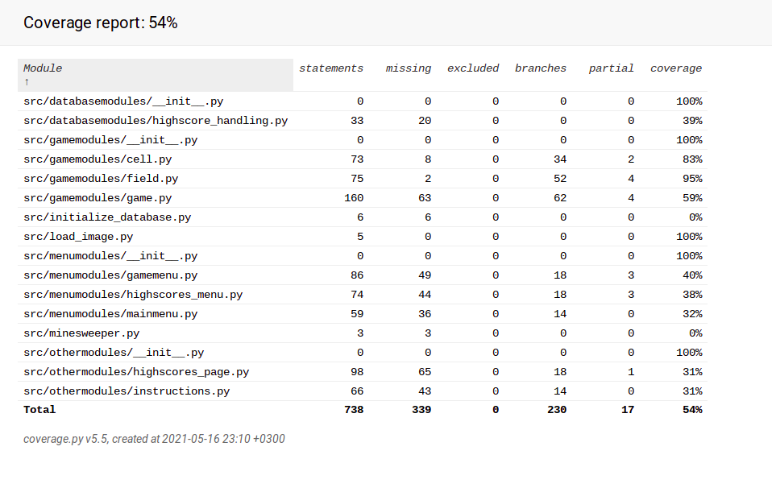

# Testausdokumentti

## Testaus:
Luokille löytyy niitä testaavat luokat src hakemiston tests hakemiston sisällä olevista *_test.py* päätteisistä moduuleista. Esimerkiksi luokkaa Cell testaa luokka TestCell. Testit suoritetaan **poetry run invoke test** komennolla.

## Testauskattavuus:
Koska käyttöliittymään liittyvää koodia ei ole eriytetty pois testauskattavuusraportista on testauskattavuus prosentti 54%

